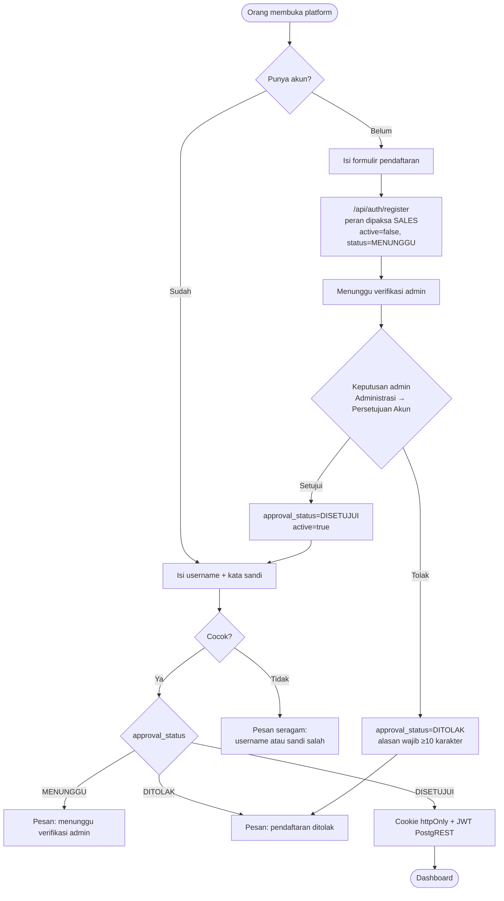
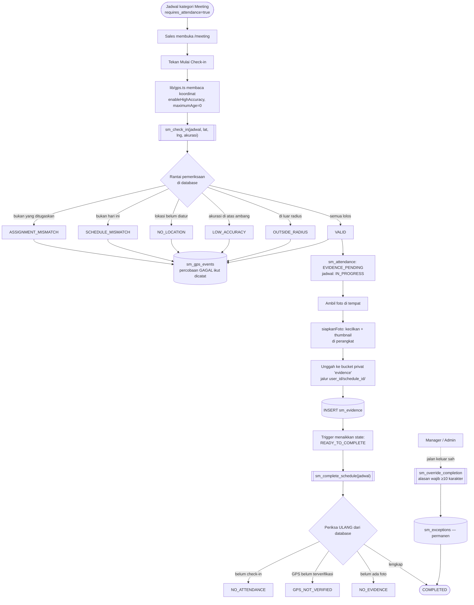
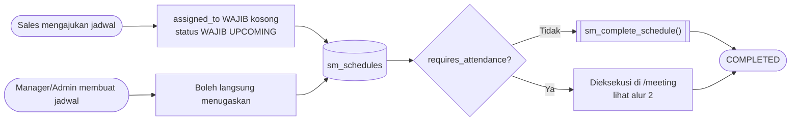
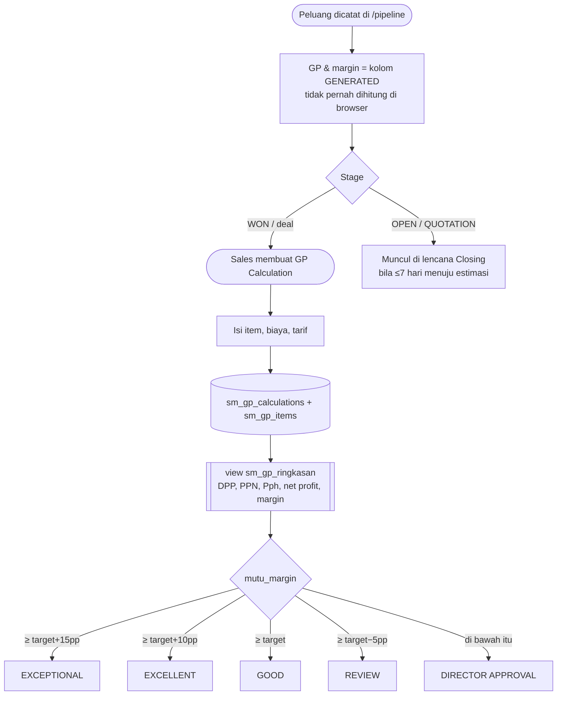
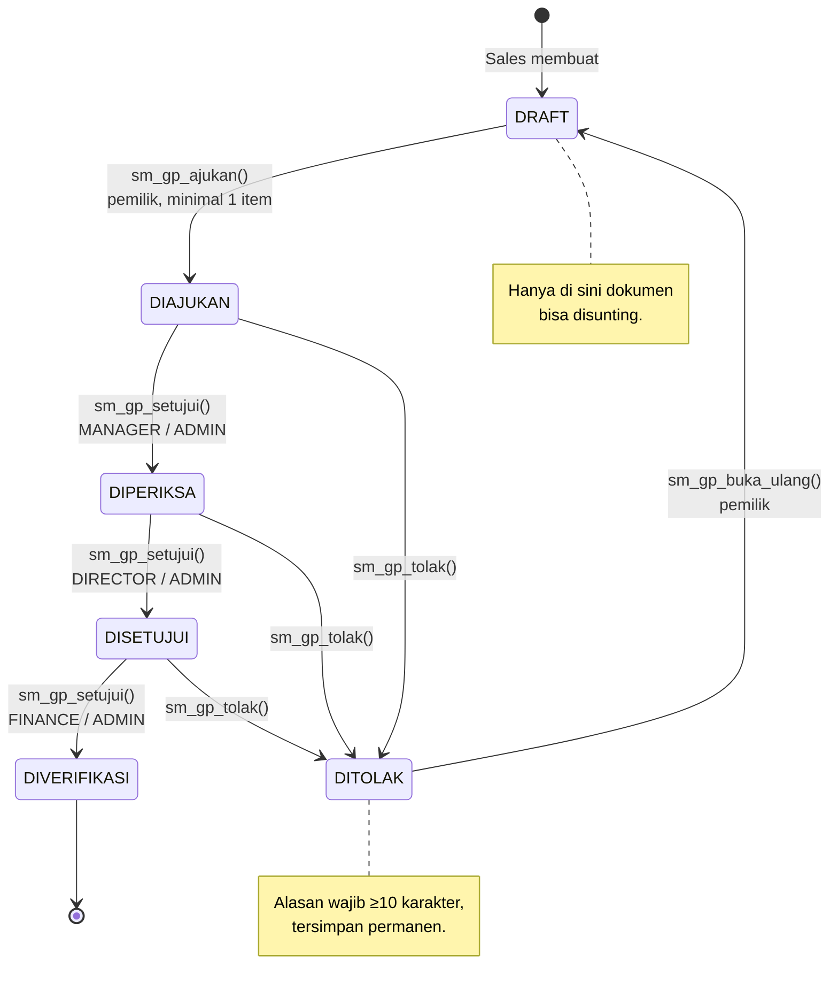
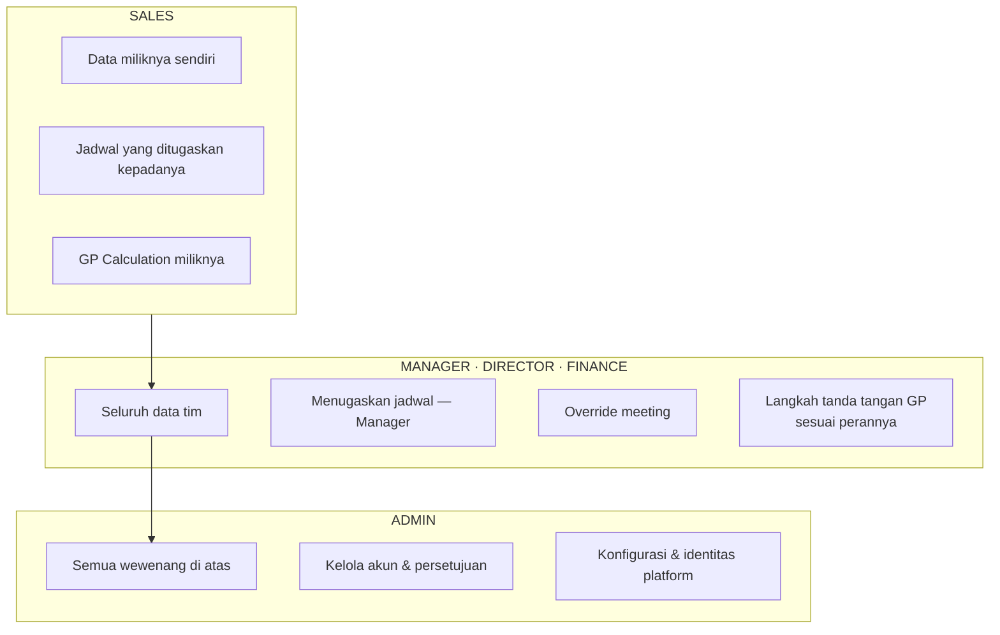
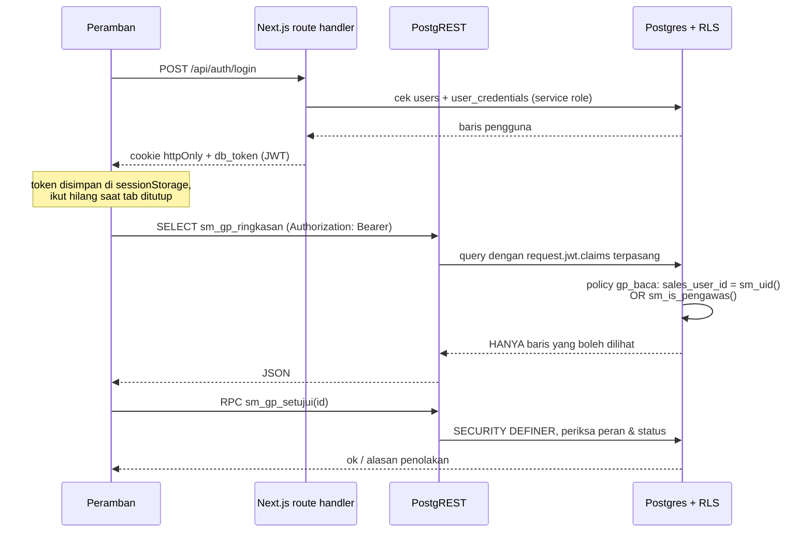
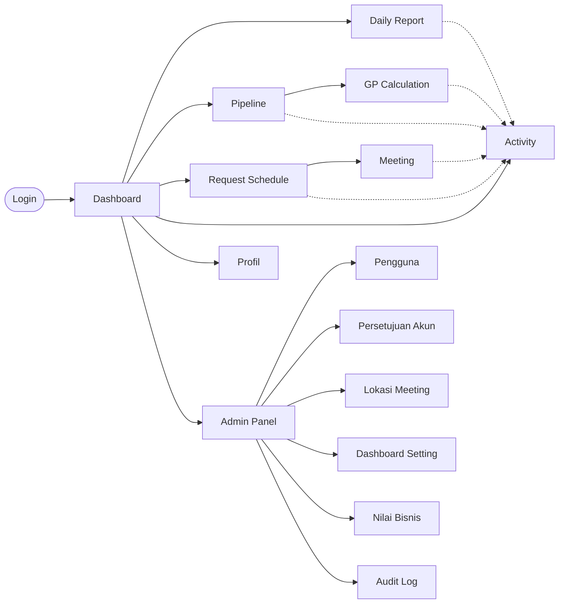

# Alur Kerja Platform

Diagram di bawah memakai sintaks Mermaid, yang dirender langsung oleh GitHub.
Setiap diagram menggambarkan alur yang **benar-benar berjalan di kode**, bukan
rancangan yang belum terwujud; di bawah tiap diagram disebutkan berkas dan
fungsi yang menegakkannya.

Satu pola berulang di seluruh dokumen ini dan perlu dipahami sekali di awal:

> **Yang menolak adalah database, bukan tampilan.**
> Tombol yang disembunyikan hanya merapikan layar. Kalau seseorang memanggil
> endpoint-nya langsung dari luar aplikasi, yang menghentikannya adalah RLS dan
> fungsi `SECURITY DEFINER` — bukan tombol yang tidak ia lihat.

---

## 1. Masuk & pendaftaran akun

**Kenapa pesannya dibedakan hanya setelah sandi benar.** Orang yang baru
mendaftar dan tidak bisa masuk tanpa penjelasan akan mengira pendaftarannya
gagal, lalu mendaftar lagi berulang kali dengan username berbeda. Sedangkan
penyerang yang belum memegang sandinya tidak memperoleh petunjuk apa pun dari
cabang itu — ia tetap hanya melihat "username atau kata sandi salah".

Berkas: `app/api/auth/register/route.ts`, `app/api/auth/login/route.ts`,
`app/(app)/admin/_components/TabPersetujuan.tsx`.

---

## 2. Meeting — check-in GPS, foto bukti, penyelesaian

Ini inti platform, dan satu-satunya alur yang tidak punya jalan pintas.

**Tiga hal yang mudah disalahpahami dari diagram ini:**

1. **Percobaan yang GAGAL ikut dicatat.** Tabel yang hanya berisi keberhasilan
   tidak bisa menjawab "apakah orang ini berkali-kali mencoba check-in dari
   luar radius" — padahal justru itu yang ingin diketahui.
2. **Syaratnya diperiksa dua kali**, saat check-in dan lagi saat penyelesaian.
   Bukan karena ragu, melainkan karena keduanya terjadi pada waktu berbeda dan
   keadaannya bisa berubah di antaranya.
3. **Override bukan bypass.** Ia menuntut alasan tertulis, mencatat siapa yang
   menyetujui, dan meninggalkan baris permanen di `sm_exceptions`.

Berkas: `supabase/migrations/004_functions.sql`, `lib/gps.ts`,
`lib/image-compress.ts`, `app/(app)/meeting/_components/PanelMeeting.tsx`.

---

## 3. Request Schedule — pengajuan & penugasan

`requires_attendance` disalin dari pengaturan kategori **saat jadwal dibuat**,
bukan dicocokkan ulang lewat nama kategori. Kalau penjaganya mencocokkan string
`category = 'Meeting'`, admin yang mengganti nama kategori itu jadi "Meeting
Client" akan diam-diam mematikan seluruh syarat GPS + foto — tanpa satu pun
pesan error.

---

## 4. Pipeline → GP Calculation

Rumus `mutu_margin` disalin apa adanya dari berkas GP asli tim. `DIRECTOR
APPROVAL` di sini **bukan status persetujuan** melainkan peringatan mutu:
marginnya lebih dari 5 poin di bawah target.

---

## 5. Rantai persetujuan GP Calculation

**Status tidak bisa ditembak langsung.** RLS membatasi *baris*, bukan *kolom*;
tanpa penjagaan tambahan, pemilik dokumen bisa menembakkan
`UPDATE status='DIVERIFIKASI'` pada barisnya sendiri selagi DRAFT dan melompati
seluruh rantai dalam satu permintaan. Karena itu hak `UPDATE` dicabut lalu
diberikan ulang hanya pada kolom isian — `status`, nomor dokumen, dan seluruh
kolom tanda tangan tidak ada dalam daftar.

Berkas: `supabase/migrations/016_gp_calculation.sql`,
`supabase/tests/keamanan-gp.sql` (uji 17–25).

---

## 6. Siapa melihat apa

Penegakannya ada pada tiga fungsi kecil di database, bukan pada kode tampilan:

| Fungsi | Isi | Dipakai |
|--------|-----|---------|
| `sm_uid()` | UUID dari klaim JWT | Seluruh policy "miliknya sendiri" |
| `sm_is_pengawas()` | MANAGER, ADMIN, DIRECTOR, FINANCE | Policy "boleh lihat semua" |
| `sm_is_admin()` | ADMIN saja | Kelola akun, pengaturan, identitas |

Director dan Finance masuk `sm_is_pengawas()` karena keduanya menandatangani GP
Calculation — tanda tangan di atas angka yang tidak boleh ia baca adalah tanda
tangan kosong. Keduanya tetap **bukan** Admin: `sm_is_admin()` tidak disentuh.

---

## 7. Perjalanan satu permintaan

Kunci yang membuat seluruh model ini bekerja: **identitas dibawa JWT terbitan
server**, bukan dikirim klien sebagai parameter biasa. `auth.uid()` bawaan
Supabase selalu NULL di platform ini karena autentikasinya tabel sendiri, jadi
`sm_uid()` membaca klaim `sub` dari token yang ditandatangani server.

---

## 8. Peta modul

Garis putus-putus menuju Activity bukan aliran data melainkan pembacaan:
`sm_activity_feed` adalah view yang **membaca** tabel modul lain setiap kali
dibuka. Tidak ada tabel aktivitas terpisah yang bisa melenceng dari sumbernya.
